# Glossa

Glossa 是一个用于语言本地化（localisation）的库。

## Functionality

按 functionality 来划分，可将其分为两类

- const map: 通过常量数据来载入本地化数据，从而实现高效的本地化。
  - 介绍：在编译期将配置文件转换为常量（const fn）rust 代码，在运行期读取常量数据。
  - 优点：高效
  - 缺点：
    - 需要 `codegen`, 代码膨胀后会有一些冗余的东西
    - 目前仅支持简单的键值（K-V）对
- fluent
  - 介绍：在运行期管理 fluent 资源
  - 优点：fluent 的语法可能更适合本地化
  - 缺点：占用更多的资源

注：fluent 同样支持在编译期加载本地化资源，但需要在运行期解析数据。  
而前者只是简单的 K-V 对，使用了常量的 phf 来存储数据。因为简单，所以高效。

两类功能相互独立，对于后者，请参阅 [Fluent.md](Fluent.md)

## codegen

使用代码生成器来生成代码。

glossa-codegen 有以下 features：

- yaml
- ron
- toml
- json
- highlight

默认启用的是 `yaml`。

除了最后一个外，其他功能对应不同类型的配置文件。  
您可以启用全部的功能，也可以按需添加。

默认根据文件名扩展名(extension, e.g. yml, yaml, toml, ron)来判断文件类型，根据文件名称来设置 Map Name(表的名称)，根据启用的功能来判断是否需要在编译期解析（反序列化）。

<!-- ```
# assets/l10n/zh
## test.yaml
- test
## test.yml
- test.yml
``` -->


假设 `assets/l10n/zh` 目录下存在两个文件，分别是 `test.yaml` 和 `test.yml`，那么我们可以认为它们有着相同的名称。

为了避免冲突，它们的 map name 分别是：

- test
- test.yml

假设有这些文件：

- test.yaml
- test.json
- test.yml
- test.ron
- test.toml

给它排序之后会变成:

- test.json
- test.ron
- test.toml
- test.yaml
- test.yml

只有 **test.json** 的 map name 是 `test`, 剩下的 map name 都是其文件名称。

> 当调用 `MapLoader` 的 `.get()` 时，您需要传入 map name。

### 准备工作

在编写 `build.rs` 之前，我们需要先准备本地化资源文件。

de (Deutsch, Lateinisch, Deutschland)

- assets/l10n/de/error.yaml

```yaml
text-not-found: Kein lokalisierter Text gefunden
```

en (English, Latin, United States)

- assets/l10n/en/error.yaml

```yaml
text-not-found: No localized text found
```

en-GB (English, Latin, Great Britain)

- assets/l10n/en-GB/error.yaml

```yaml
text-not-found: No localised text found
```

es (español, latino, España)

- assets/l10n/es/error.yaml

```yaml
text-not-found: No se encontró texto localizado
```

pt (português, latim, Brasil)

- assets/l10n/pt/error.yaml

> 注：pt 指的是“葡萄牙语（巴西）”,而不是“葡萄牙语（葡萄牙）” （português, Portugal）

```yaml
text-not-found: Nenhum texto localizado encontrado
```

### build script

先添加依赖

```sh
cargo add --build glossa-codegen
```

然后开始创建 `build.rs`。

> 该文件与 Cargo.toml 同级。

#### 项目结构与文件位置

简单的单项目结构

<!--
# workspace&ensp;
- assets&ensp;
- <span style="color: orange;">build.rs</span>&ensp;
- Cargo.lock&ensp;
- Cargo.toml&ensp;
- src&ensp;
- target&ensp;
-->


稍微复杂一点的多项目结构

<!--
```
---
markmap:
  colorFreezeLevel: 3
  maxWidth: 170
---

# workspace&ensp;
- assets&ensp;
    - l10n&ensp;
- Cargo.lock&ensp;
- Cargo.toml&ensp;
- proj1&ensp;
    - <span style="color: orange;">build.rs</span>&ensp;
    - Cargo.toml&ensp;
    - src&ensp;
    - tests&ensp;
- proj2&ensp;
    - <span style="color: orange;">build.rs</span>&ensp;
    - Cargo.toml&ensp;
    - src&ensp;
- target&ensp;
- tests&ensp;
```
-->


> 您也可以手动指定 `build.rs` 的路径，而不是使用默认的。

---

#### build.rs

<!--
```
---
markmap:
  colorFreezeLevel: 3
  maxWidth: 150
---

# _gen.run(wtr)_&ensp;

## *Generator*&ensp;

### l10n_path&ensp;
- 本地化资源所在的目录&ensp;
- 例如 <span style="color: magenta;"><b>assets/l10n</b></span>&ensp;

### version&ensp;
- 本地化资源的版本信息&ensp;

### highlight&ensp;
- 让本地化资源支持<span style="color: Orange;"><b>语法高亮</b></span>&ensp;

## *MapWriter*&ensp;

### rs_file&ensp;
- 生成的 rust 代码的文件&ensp;
- 例如：<span style="color: rgb(23, 190, 207);"><b>src/assets/l10n.rs</b></span>&ensp;

### visibility&ensp;
- 生成的函数的可见性&ensp;
- 默认为 <span style="color: rgb(44, 160, 44);"><b>pub(crate)</b></span>&ensp;

### gen_doc&ensp;
- 是否需要自动生成文档&ensp;
- 默认为 <span style="color: CornflowerBlue;"><b>true</b></span>&ensp;
```
-->



```rust
use glossa_codegen::{consts::*, prelude::*};
use std::{
    fs::File,
    io::{self, BufWriter},
    path::PathBuf,
};

fn main() -> io::Result<()> {
    // 指定版本号为当前软件包的版本, 避免相同版本反复编译
    let ver = get_pkg_version!();

    // 这是一个常量数组： ["src", "assets", "localisation.rs"]，它会转化为路径，用于存储自动生成的（与本地化相关的）rust 代码。
    // 在 Windows 上，路径为 'src\assets\localisation.rs'
    // 在 Unix 上, 路径为 "src/assets/localisation.rs"
    // 注意：这是相对路径！
    let mut path = PathBuf::from_iter(default_l10n_rs_file_arr());

    // 如果已经是相同版本，那就退出。
    if is_same_version(&path, Some(ver))? {
        // 在开发时，我们可以注释掉下面的 `return` 语句，这样子每次更改都会重新编译，不会提前退出。
        return Ok(());
    }

    // 如果路径为 "src/assets/localisation.rs"，那么它会追加 `mod localisation;` 以及相关的 `use` 语句到 "src/assets/mod.rs"
    append_to_l10n_mod(&path)?;

    // 这里会创建一个新的文件： "src/assets/localisation.rs"
    // 与 append (追加) 不同，如果只是单纯的 create (创建) 的话，那么在写入时会清空文件。
    let file = BufWriter::new(File::create(&path)?);
    let writer = MapWriter::new(file);

    // default_l10n_dir_arr() 也是一个常量数组： ["assets", "l10n"]
    // path: "assets/l10n"
    // 如果当前本地化资源的路径位于上一级的话，那么您可以使用 `path = PathBuf::from_iter([".."].into_iter().chain(default_l10n_dir_arr()));`
    path = PathBuf::from_iter(default_l10n_dir_arr());

    let generator = Generator::new(path).with_version(ver);
    // 此处调用生成器，生成代码并写入到 rs 文件
    generator.run(writer)
}
```

### MapWriter

我们在上面创建了一个 writer。

现在让我们修改代码，把 writer 改成 `mut writer`，这样子就可以对其进行修改了。

```rust
let mut writer = MapWriter::new(file);

// 是否需要自动生成文档，默认为 true
*writer.get_gen_doc_mut() = false;
// 修改自动生成的函数的可见性，默认为 `pub(crate)`
*writer.get_visibility_mut() = "pub(super)";
```

### build

运行 `cargo b` 后，会自动生成代码。  
若您的 l10n rs 文件为 `src/assets/localisation.rs`，则您还需要手动将 `pub(crate) mod assets;` 添加到 `lib.rs` 或者是 `main.rs`（这取决于您的 crate 类型）。

### 补充说明

上面的内容是最基本的用法，实际上还有更高级的用法。  
从 **0.0.1-alpha.4** 开始，支持在编译期将本地化文本存储为带有 **语法高亮** 的字符串。

与在运行期缓存/解析 regex 不同，这是常量字符串，不需要昂贵的（expensive）运行期解析。

这是某个正在开发中的 cli 工具的帮助信息的截图，其中就用到了 glossa-codegen 的高级用法。


本地化 + 常量的语法高亮 = 😍

不要急，让我们慢慢来。这些内容得要等到我们讲完新手教程之后，再来介绍。

顺带一提，它可能并没有您想象中的那么完美。

如果我们在编译前选择了像上面一样的 `Monokai` 主题，那么它会生成包含 `Monokai` 主题的高亮文本。

如果我们需要 `One Dark` 和 `ayu-dark` 等主题，要么在运行期生成，要么在编译期为不同的主题都生成一份高亮的文本。  
后者是一种用空间（二进制文件大小）来换时间的做法。

## Get Text

代码生成完毕后，让我们编写一个函数来测试一下吧！

不过在那之前，我们得要先添加依赖。

```sh
cargo add phf glossa
```

测试函数如下：

```rust
    #[test]
    fn new_loader() {
        use crate::assets::localisation::locale_hashmap;
        use glossa::{fallback::FallbackChain, GetText, MapLoader};

        let loader = MapLoader::new(locale_hashmap());
        loader.show_chain();
        // 这里为了简易性，使用了 `get_or_default()`
        // 实际上 `.get()` 的用法是一样的，不过它返回的是 Result<&str>, 而不是 Cow<str>
        let msg = loader.get_or_default("error", "text-not-found");
        assert_eq!(msg, "No localized text found");
    }
```

如果您的系统语言是 en, 那么测试应该会成功。

请注意: `locale_hashmap()` 不是 `const fn`, 而是普通的函数（它会返回一个普通 HashMap）。  
但这并不意味着开销特别大。

HashMap 查询操作的时间复杂度是 **O(1)**。

它的值指向了子表，子表以及子表的子表全都是 `consts`。

此外，如果启用了 ahash feature，那么默认会使用 ahash 的 RandomState, 而不是标准库的。

您还可以用 OnceCell 来创建全局静态数据, 只创建一次数据。

```rust
pub(crate) fn locales() -> &'static MapLoader {
    static RES: OnceCell<MapLoader> = OnceCell::new();
    RES.get_or_init(|| MapLoader::new(locale_hashmap()))
}
```

> 等等，别扯这些没用的，我们刚刚的测试失败了。

好吧，让我们重新回顾之前做的事情。  
我们之前创建了德语、西班牙语和葡萄牙语的本地化资源文件。

首先，它会自动检测系统语言，如果本地化资源不存在，那么它会自动使用 fallback chain。  
如果本地化资源存在，并且您的系统语言不是英语，那么上面的测试会失败。

让我们继续测试：

```rust
let loader = locales();
let msg = loader.get("error", "text-not-found")?;
```

假设您的语言是德语 (de-Latn-DE)

```rust
assert_eq!(msg, "Kein lokalisierter Text gefunden");
```

西班牙语 (es-Latn-ES)

```rust
assert_eq!(msg, "No se encontró texto localizado");
```

葡萄牙语 (pt-Latn-BR)

```rust
assert_eq!(msg, "Nenhum texto localizado encontrado");
```

## 常量的语法高亮文本

需要启用 highlight feature

```sh
cargo add --build glossa-codegen --features=highlight
```

在 `build.rs` 中， 我们得要导入以下模块:

```rust
use glossa_codegen::{
    consts::*,
    highlight::{HighLight, HighLightFmt, HighLightRes},
    prelude::*,
};
use std::{
    borrow::Cow,
    collections::HashMap,
    ffi::OsStr,
    fs::File,
    io::{self, BufWriter},
    path::PathBuf,
};
```

### Quick Start

先来个简单的例子吧！

> 在创建 `generator` 之前，所需的准备工作请参阅上文。

<!--
```
---
markmap:
  colorFreezeLevel: 3
  maxWidth: 150
---

# HighLight&ensp;
## resource&ensp;

- HighLightRes&ensp;

## files(Map)&ensp;

- Key
  - <b><span style="color: CornflowerBlue;">OsStr(</span><span style="color: Orange;">File Name</span><span style="color: CornflowerBlue;">)</span></b>&ensp;
- Value
  - HighLightFmt&ensp;
```
-->


```rust
    let mut generator = Generator::new(path).with_version(ver);
    // 使用默认的语法高亮资源
    // 默认的主题为 Monokai Extended, 默认的 syntax set 只包含少量的 syntaxes
    let res = HighLightRes::default();

    let os_str = |s| Cow::from(OsStr::new(s));
    // 默认的格式为 markdown ， 默认的 map name suffix 为 `_md`
    let fname_and_fmt = |s| (os_str(s), HighLightFmt::default());

    // 指定需要高亮的文件名称
    let map = HashMap::from_iter([fname_and_fmt("opt.toml"), fname_and_fmt("parser.yaml")]);

    *generator.get_highlight_mut() = Some(HighLight::new(res, map));

    generator.run(writer)?;
```

### HighLightRes

<!--
```
---
markmap:
  colorFreezeLevel: 2
  maxWidth: 150
---

# HighlightRes(高亮资源)&ensp;
## name&ensp;

- 主题名称&ensp;
- 默认为 _Monokai Extended_&ensp;

## syntax_set&ensp;
- 语法资源的合集&ensp;

## theme_set&ensp;
- 主题资源的合集&ensp;

## background&ensp;

- 是否启用主题背景&ensp;
- 默认为 <b><span style="color: CornflowerBlue;">true</span></b>&ensp;
```
-->



您可以使用 syntect 载入自定义的 theme-set 和 syntax-set。  
这些资源本质上是 sublime 的主题和语法。  
您可以使用 `HighLightRes::new()` 来指定 `theme_set` ，或者是先获取 theme_set 的可变引用: `*res.get_theme_set_mut()` ，再修改。

```rust
let mut res = HighLightRes::default();
// *res.get_theme_set_mut() = 自定义的主题集
// *res.get_syntax_set_mut() = 自定义的语法集 //需要 'static 生命周期, 您可以用 OnceCell 来创建

// 自定义主题名称, 例如 ayu-dark
*res.get_name_mut() = Cow::from("ayu-dark");

// 是否启用主题背景
*res.get_background_mut() = false;
```

### HighLightFmt

<!--
```
---
markmap:
  colorFreezeLevel: 6
  maxWidth: 190
---

# opt.toml&ensp;

## raw text&ensp;

- map name&ensp;
  - <b><span style="color: rgb(23, 190, 207);">opt</span></b>&ensp;
- l10n map fn name&ensp;
  - get_zh_map_opt&ensp;
  - get_en_gb_map_opt&ensp;

## highlighted text&ensp;

### suffix&ensp;

- <b><span style="color: CornflowerBlue;">Some("_md")</span></b>&ensp;
    - map name&ensp;
        - <b><span style="color: rgb(23, 190, 207);">opt_md</span></b>&ensp;
    - l10n map fn name&ensp;
        - get_zh_map_opt_md&ensp;
        - get_en_gb_map_opt_md&ensp;
- <b><span style="color: Orange;">None</span></b>&ensp;
    - map name&ensp;
        - <b><span style="color: rgb(23, 190, 207);">opt</span></b>&ensp;
        - Note: If suffix is None, then only highlight, not raw&ensp;
    - l10n map fn name&ensp;
        - get_zh_map_opt&ensp;
        - get_en_gb_map_opt&ensp;
```

```
---
markmap:
  colorFreezeLevel: 2
  maxWidth: 150
---

# HighLightFmt&ensp;
## syntax&ensp;

- 语法的名称&ensp;
- 默认为 <b><span style="color: Orange;">markdown<span></b>&ensp;

## suffix&ensp;

- map name 的后缀&ensp;
- 默认为 <b><span style="color: Orange;">_md<span></b>&ensp;

## extra&ensp;

- 设置额外的主题&ensp;

``` -->

先解释一下，所谓的 map name 到底指的是什么。


map 指的是映射关系，也就是我们俗称的 “表”。

由于它会将本地化文本转换成表，因此了解 highlight text 对应的 Map name 是至关重要的。



```rust
let mut fmt = HighLightFmt::default();

// 这里指定了 syntax name 为 "md"，默认的语法集仅支持 markdown, toml, json & yaml 等。
// 您如果要支持更多的语法，得要自定义 HighLightRes 的 syntax-set。
// md 对应的是 `Markdown` 格式的 filename extension
// 您可以认为 syntax name 对应的是不同格式的文件扩展名。
*fmt.get_syntax_mut() = Cow::from("md");

// 修改默认 map name 的后缀。
// 假设有个文件为 opt.toml，那么 raw 文本对应的 map name为 `opt`。
// 由于 suffix 是 `_markdown`, 故生成的高亮文本的 map name 是 `opt_markdown`
// 如果为 None, 则不会有 raw 文本的 map，只有高亮文本的 map。
*fmt.get_suffix_mut() = Some(Cow::from("_markdown"));
```

#### Extra

<!--
```
---
markmap:
  colorFreezeLevel: 3
  maxWidth: 128
---

# extra

## key

- map name 的后缀

## value

- 主题名称
    - 如果为空，则会自动跳过
- 是否启用主题背景
    - 只能为 <span style="color: SkyBlue;">true</span> 或 <span style="color: Violet;">false</span>
``` -->



语法高亮是可选的。  
如果要求语法高亮，那么主题是必选的。

我们之前已经在 `HighLightRes` 中指定了共用（common）的主题名称。

您如果需要为更多的主题生成高亮的文本，则需修改 `extra`。

```rust
// 这个元组的内容为 (map name后缀, (主题名称, 是否启用主题背景))
let ayu_light = ("_ayu_light", ("ayu-light", true));
let monokai_bright = ("_Monokai-Bright", ("Monokai Extended Bright", false));

let extra_map = HashMap::from_iter([monokai_bright, ayu_light]);

*fmt.get_extra_mut() = Some(extra_map);
```

#### 关于 common 主题与 extra 主题

共用的主题名称包含在 HighLightRes 结构体中，额外的主题名称包含在 HighLightFmt 中。

之所以强调 “名称”，是因为主题名称可以分开存，而主题资源却不是。

您如果不需要这么精细化地控制“不同的文件对应的主题”，则无需关注本小节的内容。

您可以选择共用主题 + 额外的主题，只需要像 `Extra` 那样修改 `*fmt.get_extra_mut()` 即可。

如果不需要 common 主题， 则必须要将 HighLightRes 的主题名称设置为空。

```rust
*res.get_name_mut() = Cow::from("");
```

剩下的事情就是为不同的格式修改 `extra` 了。

比如：

- `*md_fmt.get_extra_mut() = Some(ext_map1)`
- `*rs_fmt.get_extra_mut() = Some(ext_map2)`
- `*html_fmt.get_extra_mut() = Some(ext_map3)`

### Highlight File Map


我们之前使用了如下语句创建了 Highlight File Map。

```rust
let fname_and_fmt = |s| (os_str(s), HighLightFmt::default());
let map = HashMap::from_iter([fname_and_fmt("opt.toml"), fname_and_fmt("parser.yaml")]);
```

如果我们把它改成这样子，那么所有指定的文件都会使用我们上面指定的 HighLightFmt

```rust
let fname_and_fmt = |s| (os_str(s), fmt.clone());
```

别忘了，我们上面为 `fmt` 创建了额外的(`extra`)主题。  
在很多时候，我们需要做更多的调整，而不是为所有的文件都使用额外的主题。

```rust
// 假设您设定了自定义 syntax-set, 里面包含了您想要的 LaTex 的 syntax。
let mut tex_fmt = HighLightFmt::default();
*tex_fmt.get_suffix_mut() = Some(Cow::from("_tex"));
*tex_fmt.get_syntax_mut() = Cow::from("latex");
// tex_fmt 指定了额外的 dracula 主题
*tex_fmt.get_extra_mut() =
    Some(HashMap::from_iter([("_tex_dracula", ("dracula", false))]));

let dracula_latex = |s| (os_str(s), tex_fmt);

let highlight_map = HashMap::from_iter([
    // 在 k = v 的映射关系中，v 包含了 LaTex 公式的字符串
    dracula_latex("math.toml"),
    fname_and_fmt("file.json"),
    fname_and_fmt("test.yaml"),
    (os_str("parser.ron"), HighLightFmt::default()),
]);
```

其实使用 LaTex 作为例子可能不太恰当，因为它只是语法高亮而已，并不能把 LaTex 渲染成 svg。

### Summary


