# Glossa

[](https://crates.io/crates/glossa)

[](https://docs.rs/glossa)

[](./License)

[中文](Readme-zh.md)

Glossa is a language localisation library.

## Functionality

It can be divided into two categories.

- Const map: Load localisation data efficiently through constant data.
  - Description: Convert configuration files into constant (`const fn`) code at compile time and read constant data at runtime.
  - Pros: Efficient
  - Cons:
    - Requires `codegen`, which may result in some redundant code after expansion.
    - Currently only supports simple key-value (K-V) pairs.
- fluent
  - Description: Manage Fluent resources at runtime.
  - Pros: Fluent syntax may be more suitable for localisation.
  - Cons: Requires more resources than `const map`.

Note: Fluent also supports loading localisation resources (localised files) at compile time, but data needs to be parsed at runtime.  
The former is just the simple K-V pair that uses some const maps from phf to store data. Because it's simple, it's efficient.

The two types of functionalities are independent of each other. For the latter, please read [Fluent.md](Fluent.md).

## Codegen

[](https://crates.io/crates/glossa-codegen)

Use a code generator to generate code.

`glossa-codegen` has the following features:

- yaml
  - Enabled by default.
  - The default file extension is "yaml" or "yml"
- ron
  - The default ext is "ron"
- toml
  - The ext is "toml"
- json
  - ext: "json"
- highlight

In addition to highlight, this corresponds to different types of configuration. You can enable all features or add them as needed.

By default, the file type is determined based on the file name extension, and the **map name** (table name) is set based on the file name. Whether deserialisation is needed at compile-time is determined by the enabled feature.


Assuming there are two files under the directory `assets/l10n/en`, named `test.yaml` and `test.yml`, then we can consider them to have the same name.

To avoid conflicts, their map names are:

- test
- test.yml

If we have these files:

- test.yaml
- test.json
- test.yml
- test.ron
- test.toml

Sorting them would result in:

- test.json
- test.ron
- test.toml
- test.yaml
- test.yml

Only the map named `test` is in **test.json**, whereas the rest of the maps are named after their respective file names.

> When using `.get()` with `MapLoader`, you need to pass in the map-name

### Preparations

Before writing `build.rs`, we need to prepare the localisation resource files.

de (Deutsch, Lateinisch, Deutschland)

- assets/l10n/de/error.yaml

```yaml
text-not-found: Kein lokalisierter Text gefunden
```

en (English, Latin, United States)

- assets/l10n/en/error.yaml

```yaml
text-not-found: No localized text found
```

en-GB (English, Latin, Great Britain)

- assets/l10n/en-GB/error.yaml

```yaml
text-not-found: No localised text found
```

es (español, latino, España)

- assets/l10n/es/error.yaml

```yaml
text-not-found: No se encontró texto localizado
```

pt (português, latim, Brasil)

- assets/l10n/pt/error.yaml

> Note: "pt" refers to "Portuguese (Brazil)", not "Portuguese (Portugal)" (português, Portugal).

```yaml
text-not-found: Nenhum texto localizado encontrado
```

### build script

First, add the dependency:

```sh
cargo add --build glossa-codegen
```

Then start creating `build.rs`.

> This file is at the same level as Cargo.toml.

#### Project structure and file location

For a simple single-project structure:


A slightly more complex multi-project structure:


> You can also specify the path to `build.rs` manually, instead of using the default.

---

#### build.rs

<!--
```
---
markmap:
  colorFreezeLevel: 3
  maxWidth: 200
---

# generator.run(writer)

## Generator

### l10n_path

- The directory where localised resources are located
- For example: <span style="color: magenta;">assets/l10n</span>

### version
- Version information for localised resources

### highlight
- Enables <b><span style="color: Orange;">syntax highlighting</span></b> for localised resources

## MapWriter

### rs_file
- The Rust code file that will be generated
- For example: <b><span style="color: DarkCyan;">src/assets/localisation.rs</span></b>

### visibility
- The visibility of generated functions
- Default is <b><span style="color: rgb(44, 160, 44);">pub(crate)</span></b>

### gen_doc
- Whether to generate documentation automatically
- Default is <b><span style="color: CornflowerBlue;">true</span></b>
```
-->



```rust
use glossa_codegen::{consts::*, prelude::*};
use std::{
    fs::File,
    io::{self, BufWriter},
    path::PathBuf,
};

fn main() -> io::Result<()> {
    // Specify the version as the current package version to avoid repetitive compilation for the same version.
    let ver = get_pkg_version!();

    // This is a constant array: ["src", "assets", "localisation.rs"], which is converted into a path for storing automatically generated Rust code related to localisation.
    // On Windows, the path is 'src\assets\localisation.rs'.
    // On Unix, the path is "src/assets/localisation.rs".
    // Note: this is a relative path!
    let mut path = PathBuf::from_iter(default_l10n_rs_file_arr());

    // If it's the same version, then exit.
    if is_same_version(&path, Some(ver))? {
      // When developing, we can comment out the `return` statement below so that every change will be recompiled and won't exit prematurely.
        return Ok(());
    }

    // If the path is "src/assets/localisation.rs", then it will append `mod localisation;` and related `use` statements to "src/assets/mod.rs".
    append_to_l10n_mod(&path)?;

    // This creates a new file: "src/assets/localisation.rs".
    // Unlike append, if only create is used, then the file will be cleared when it is written.
    let mut file = BufWriter::new(File::create(&path)?);
    let writer = MapWriter::new(file);

    // default_l10n_dir_arr() is also a constant array: ["assets", "l10n"].
    // If the current localisation resource path is at the parent level, then you can use `path = PathBuf::from_iter([".."].into_iter().chain(default_l10n_dir_arr()));`.
    path = PathBuf::from_iter(default_l10n_dir_arr());

    let generator = Generator::new(path).with_version(ver);
    // Invoke the generator here to generate code and write it to the `rs` file.
    generator.run(writer)
}
```

### MapWriter

We created a writer above.

Now let's modify the code and change `writer` to `mut writer` so that it can be modified.

```rust
let mut writer = MapWriter::new(file);

// Whether to automatically generate documentation, defaults to true
*writer.get_gen_doc_mut() = false;
// Modify the visibility of the automatically generated function, defaults to `pub(crate)`
*writer.get_visibility_mut() = "pub(super)";
```

### Additional Information

The above content is the most basic usage, but there are actually more advanced usages.

Starting from **0.0.1-alpha.4**, it is possible to compile localised text into string with **syntax highlighting** at compile time.

Unlike caching/parsing regexes at runtime, the constant string does not require expensive runtime parsing.

Here is a screenshot of the help information for a CLI tool currently in development, which uses the advanced features of `glossa-codegen`.

> Please do not mind what language is being used inside.
> As a project that supports l10n, it supports various languages.
> This is just a demonstration of its localisation and syntax highlighting effects.


L10n + constant syntax highlighting = 😍

Don't worry, let's take it slowly. We'll introduce these features after we finish the beginner's tutorial.

By the way, it may not be as perfect as you imagine.

If we choose a `Monokai` theme before compilation, it will generate highlighted text with the `Monokai` theme.

If we need themes like `One Dark` and `ayu-dark`, we can either generate them at runtime or generate highlighted text for each theme during compilation.

The latter is a trade-off between space (binary file size) and time.

### build

After running `cargo b`, the code will be generated automatically. If your l10n rs file is `src/assets/localisation.rs`, you will also need to manually add `pub(crate) mod assets;` to `lib.rs` or `main.rs` (depending on the type of crate you have).

## Get Text

Now that the code has been generated, let's write a function to test it!

But before that, we need to add some dependencies.

```sh
cargo add phf glossa
```

The test function is as follows:

```rust
    #[test]
    fn new_loader() {
        use crate::assets::localisation::locale_hashmap;
        use glossa::{fallback::FallbackChain, GetText, MapLoader};

        let loader = MapLoader::new(locale_hashmap());
        loader.show_chain();
        // Here, for simplicity, `get_or_default()` is used.
        // Actually, the usage of `.get()` is the same, but it returns Result<&str>, not Cow<str>.
        let msg = loader.get_or_default("error", "text-not-found");
        assert_eq!(msg, "No localized text found");
    }
```

If your system language is "en", the test should pass.

Note that `locale_hashmap()` is not a `const fn` but a regular function.
However, this does not mean that it is particularly expensive.

The time complexity of HashMap query operation is **O(1)**.

Its value points to a sub-map, and all sub-maps and their sub-maps are `consts`.

In addition, if the `ahash` feature is enabled, the RandomState of ahash will be used by default instead of the `std::collections`.

You can also use OnceCell to create global static data, creating data only once.

```rust
pub(crate) fn locales() -> &'static MapLoader {
    static RES: OnceCell<MapLoader> = OnceCell::new();
    RES.get_or_init(|| MapLoader::new(locale_hashmap()))
}
```

> Wait a minute, don't waste time on these things, our previous test failed.

All right, let's revisit what we did before.  
We have previously created localisation resource files for German, Spanish and Portuguese.

Firstly, it will automatically detect the system language. If the localisation resource does not exist, it will automatically use a fallback chain.
If the localisation resource exists and your system language is not English, then the above test will fail.

Let's continue to test:

```rust
let loader = locales();
let msg = loader.get("error", "text-not-found")?;
```

Assuming your language is German (de-Latn-DE)

```rust
assert_eq!(msg, "Kein lokalisierter Text gefunden");
```

Spanish (es-Latn-ES)

```rust
assert_eq!(msg, "No se encontró texto localizado");
```

Portuguese (pt-Latn-BR)

```rust
assert_eq!(msg, "Nenhum texto localizado encontrado");
```

## Constant Syntax Highlighting Text

You need to enable the `highlight` feature:

```sh
cargo add --build glossa-codegen --features=highlight
```

In the `build.rs` file, you'll need to import the following modules:

```rust
use glossa_codegen::{
    consts::*,
    highlight::{HighLight, HighLightFmt, HighLightRes},
    prelude::*,
};
use std::{
    borrow::Cow,
    collections::HashMap,
    ffi::OsStr,
    fs::File,
    io::{self, BufWriter},
    path::PathBuf,
};
```

### Quick Start

Let's start with a simple example!

> Before creating the `generator`, please refer to the previous section for the necessary preparations.


```rust
let mut generator = Generator::new(path).with_version(ver);

// Use the default syntax highlighting resources.
// The default theme is Monokai Extended, and the default syntax set only contains a few syntaxes.
let res = HighLightRes::default();

let os_str = |s| Cow::from(OsStr::new(s));
// The default format is markdown, and the default map name suffix is `_md`.
let fname_and_fmt = |s| (os_str(s), HighLightFmt::default());

// Specify the file names that need to be highlighted.
let map = HashMap::from_iter([fname_and_fmt("opt.toml"), fname_and_fmt("parser.yaml")]);

*generator.get_highlight_mut() = Some(HighLight::new(res, map));

generator.run(writer)?;
```

### HighLightRes

<!--
```
---
markmap:
  colorFreezeLevel: 2
  maxWidth: 150
---

# HighlightRes (Syntax Highlighting Resources)&ensp;

## name&ensp;

- The name of the theme&ensp;
- Default is _Monokai Extended_&ensp;

## theme_set&ensp;

- A collection of resources for themes&ensp;

## syntax_set&ensp;

- A collection of resources for syntaxes&ensp;

## background&ensp;

- Whether to enable the theme background&ensp;
- Default is <b><span style="color: CornflowerBlue;">true</span></b>&ensp;
``` -->


You can use `syntect` to load custom theme-sets and syntax-sets.  
These resources are essentially Sublime themes and syntaxes.
You can use `HighLightRes::new()` to specify the `theme_set`, or first get a mutable reference to the theme-set using `*res.get_theme_set_mut()`, and then modify it.

```rust
let mut res = HighLightRes::default();
// *res.get_theme_set_mut() = custom theme set
// *res.get_syntax_set_mut() = custom syntax set // requires 'static lifetime, you can create it using OnceCell

// Custom theme name, e.g. ayu-dark
*res.get_name_mut() = Cow::from("ayu-dark");

// Whether to enable theme background
*res.get_background_mut() = false;
```

### HighLightFmt

First, let me explain what is meant by the term 'map name'.


Map refers to a mapping relationship, which is commonly referred to as a 'table'.

As it converts localised text into maps, understanding the map name corresponding to the highlight text is crucial.

<!--
```
---
markmap:
  colorFreezeLevel: 2
---
# HighLightFmt&ensp;
## Syntax&ensp;

- Name of the syntax&ensp;
- Default is <b><span style="color: Orange;">markdown<span></b>&ensp;

## Suffix&ensp;

- Suffix of the map name&ensp;
- Default is <b><span style="color: Orange;">_md<span></b>&ensp;

## Extra&ensp;

- Set extra themes&ensp;
``` -->



```rust
let mut fmt = HighLightFmt::default();

// Here, the syntax name is specified as "md". By default, the syntax set only supports Markdown, TOML, JSON, and YAML etc.
// If you want to support more syntaxes, you need to customise the syntax-set of HighLightRes.
// md corresponds to the filename extension of the Markdown format.
// You can think of the syntax name as corresponding to different file extensions.
*fmt.get_syntax_mut() = Cow::from("md");

// Modifies the suffix of the default map name.
// Assuming a file is named opt.toml, the raw text corresponds to the map name `opt`.
// Since the suffix is `_markdown`, the map name of the generated highlighted text is `opt_markdown`.
// If it is None, there will be no raw text map, only a highlighted text map.
*fmt.get_suffix_mut() = Some(Cow::from("_markdown"));
```

#### Extra

<!--
```
---
markmap:
  colorFreezeLevel: 3
  maxWidth: 100
---

# extra

## key

- Suffix of the map name.

## value

- Theme name.
    - If empty, it will be skipped automatically.
- Enable theme background.
    - Can only be true or false.
``` -->


Syntax highlighting is optional. If syntax highlighting is required, then the theme is mandatory.

Previously, we specified a common theme name in `HighLightRes`.

If you need to generate highlighted text for more themes, you need to modify `extra`.

```rust
// This tuple contains (map name suffix, (theme name, whether to enable the theme background))
let ayu_light = ("_ayu_light", ("ayu-light", true));
let monokai_bright = ("_Monokai-Bright", ("Monokai Extended Bright", false));

let extra_map = HashMap::from_iter([monokai_bright, ayu_light]);

*fmt.get_extra_mut() = Some(extra_map);
```

#### About common theme and extra themes

The common theme name is included in the `HighLightRes` structure, while extra theme names are included in `HighLightFmt`.

The reason for emphasizing "name" is that theme names can be stored separately, but theme resources cannot.

If you don't need to control "different files corresponding to different themes" so finely, you don't need to pay attention to this section.

You can choose a common theme + extra themes, just modify `*fmt.get_extra_mut()` like `Extra`.

If you don't need a common theme, you must set the theme name of `HighLightRes` to empty.

```rust
*res.get_name_mut() = Cow::from("");
```

The rest of the work is to modify `extra` for different formats.

For example:

- `*md_fmt.get_extra_mut() = Some(ext_map1)`
- `*rs_fmt.get_extra_mut() = Some(ext_map2)`
- `*html_fmt.get_extra_mut() = Some(ext_map3)`

### Highlight File Map


The following statement was used to create a Highlight File Map.

```rust
let fname_and_fmt = |s| (os_str(s), HighLightFmt::default());
let map = HashMap::from_iter([fname_and_fmt("opt.toml"), fname_and_fmt("parser.yaml")]);
```

If we change it to this, all specified files will use the `HighLightFmt` specified above:

```rust
let fname_and_fmt = |s| (os_str(s), fmt.clone());
```

Don't forget that we created extra themes for `fmt` above.

In many cases, we need to make more adjustments instead of using extra themes for all files.

```rust
// Assuming you have set a custom syntax-set that includes the syntax you want for LaTex.
let mut tex_fmt = HighLightFmt::default();
*tex_fmt.get_suffix_mut() = Some(Cow::from("_tex"));
*tex_fmt.get_syntax_mut() = Cow::from("latex");
// tex_fmt specifies an extra dracula theme.
*tex_fmt.get_extra_mut() =
    Some(HashMap::from_iter([("_tex_dracula", ("dracula", false))]));

let dracula_latex = |s| (os_str(s), tex_fmt);

let highlight_map = HashMap::from_iter([
    dracula_latex("math.toml"),
    fname_and_fmt("file.json"),
    fname_and_fmt("test.yaml"),
    (os_str("parser.ron"), HighLightFmt::default()),
]);
```

Actually, using LaTex as an example may not be appropriate because it only provides syntax highlighting and cannot render LaTex into SVG.

### Summary


