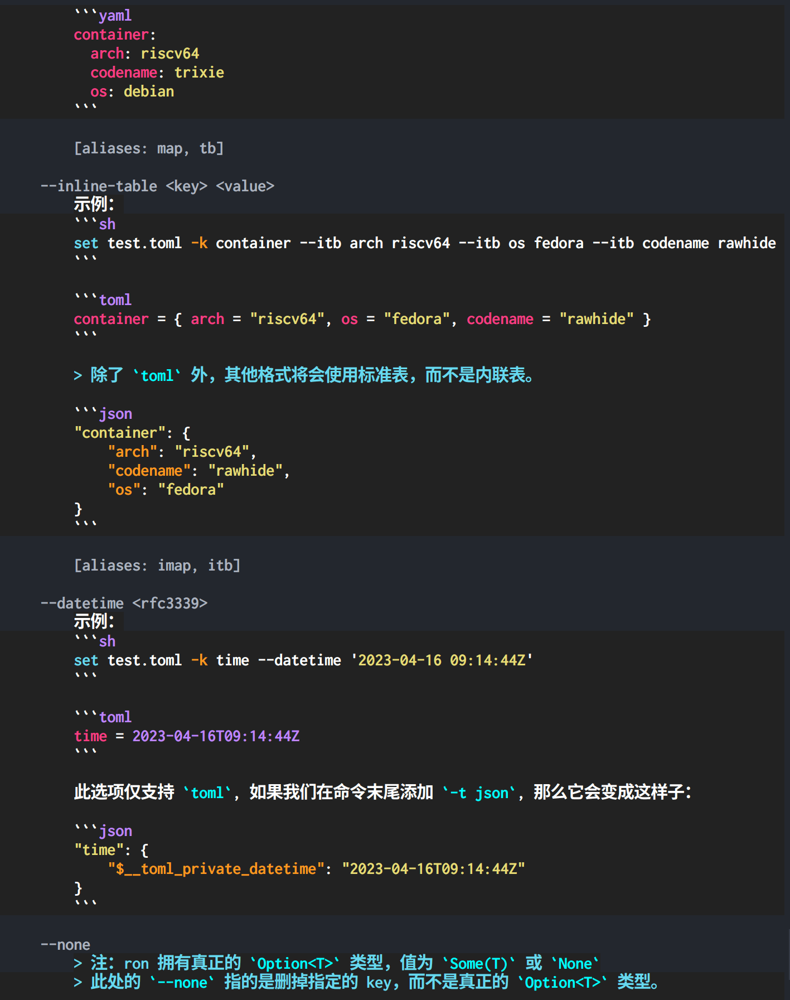

# glossa-codegen

[](https://crates.io/crates/glossa-codegen)

[](https://docs.rs/glossa-codegen)
[](../License)

<details>
<summary>
<a href="Readme-zh.md">

</a>
</summary>

- en: English
- [zh: 中文](Readme-zh.md)
- [zh-Hant: 繁體中文](Readme-zh-Hant.md)

</details>

<!-- https://img.shields.io/badge/Table%20of%20Contents-2CA5E0.svg?logo=readme&logoColor=white -->
<details open>
<summary>

</summary>

- [Core Concepts](#core-concepts)
  - [Language ID and Map Name](#language-id-and-map-name)
  - [L10n Data](#l10n-data)
  - [Raw L10n Text Syntax](#raw-l10n-text-syntax)
    - [Standard K-V Pairs](#standard-k-v-pairs)
    - [glossa-DSL](#glossa-dsl)
      - [1. Basic **key = "value"**](#1-basic-key--value)
      - [2. References](#2-references)
      - [3. External Arguments](#3-external-arguments)
        - [Difference between `{ 🐱 }` and `{ $🐱 }`](#difference-between----and---)
      - [4. Selectors (Conditional Logic)](#4-selectors-conditional-logic)
      - [5. Escape Syntax](#5-escape-syntax)
  - [MapType](#maptype)
- [L10nResources (Localization Resources)](#l10nresources-localization-resources)
- [Generator](#generator)
  - [Constructing a Generator](#constructing-a-generator)
  - [Output Methods](#output-methods)
    - [Code Generation: Const Functions with `match` Expressions](#code-generation-const-functions-with-match-expressions)
      - [**`output_match_fn()`**](#output_match_fn)
      - [**`output_match_fn_all_in_one()`**](#output_match_fn_all_in_one)
      - [**`output_match_fn_all_in_one_by_language_and_key()`**](#output_match_fn_all_in_one_by_language_and_key)
    - [Code Generation: PHF Maps](#code-generation-phf-maps)
      - [**`output_phf()`**](#output_phf)
      - [**`output_phf_all_in_one()`**](#output_phf_all_in_one)
    - [Bincode](#bincode)
      - [**`output_bincode()`**](#output_bincode)
- [Advanced Usage](#advanced-usage)
  - [Syntax Highlighting](#syntax-highlighting)
    - [Data Structures](#data-structures)
    - [Example Configuration (Pseudocode)](#example-configuration-pseudocode)
    - [Key Rules](#key-rules)
    - [Example](#example)

</details>

---

glossa-codegen is used to generate Rust code (with localized texts) and bincode files.

> Note: Although glossa-codegen requires std, both glossa and glossa-shared support no-std environments.
>
> - glossa-codegen is used to generate **production** code.
> - glossa is used to build fallback chains.
> - glossa-shared provides data types required by **production** code.
>
> You only need to include glossa-codegen in `#[test]` tests or `build.rs`, not in production code.

## Core Concepts

### Language ID and Map Name

Assume a `locales` directory with the following structure:

```plaintext
locales
  ├── ar
  │   └── error.yaml
  ├── en
  │   ├── error.yaml
  │   └── yes-no.toml
  ├── es
  │   └── yes-no.toml
  ├── fr
  │   └── yes-no.toml
  ├── ru
  │   └── error.yaml
  └── zh
      ├── error.yaml
      └── yes-no.toml
```

Here, `"ar", "en", "es", "fr", "ru", "zh"` are **Language IDs**.

`"error"` and `"yes-no"` are **Map Names**.

> Different file stems (e.g., `a.toml`, `b.json`) correspond to different map names.
>
> What about identical stems? (e.g., `a.toml` and `a.json`)

Q: If multiple files with the same stem exist (e.g., `error.yaml`, `error.yml`, `error.toml`, etc.), which one becomes the actual `"error"` map?

A:
If all files are valid and non-empty K-V pairs, it depends on luck!
Otherwise, the first **valid** file with the same stem becomes the map.

> Note: `a.toml` (stem: `a`) and `a.dsl.toml` (stem: `a.dsl`) are **not** considered the same.
> However, `en/a.toml` and `en/subdir/a.json` are considered the same stem.

Q: Why does it depend on luck?

A:
Because during the initialization of localization resources, we utilize Rayon for parallel multi-threaded deserialization (multiple files are read and parsed across threads).

The execution order is non-deterministic.

> Thread scheduling and file processing completion timing depend on runtime conditions, making the final initialization result probabilistically variable.

### L10n Data

| L10n Type           | Description                                    |
| ------------------- | ---------------------------------------------- |
| Raw Text Files      | Untreated source files (e.g., `en/hello.toml`) |
| Generated Rust Code | Hardcoded into the program via `const fn`      |
| Bincode             | Binary files for efficient deserialization     |

Raw files can be seen as source code, while other formats are compiled from them.

### Raw L10n Text Syntax

#### Standard K-V Pairs

The most basic type.

TOML example:

```toml
world = "世界"
"🐱" = "喵 ฅ(°ω°ฅ)"
```

JSON5 example:

```json5
{
  // JSON5 supports comments
  "world": "世界",
  "🐱": "喵 ฅ(°ω°ฅ)", // Trailing commas allowed
}
```

#### glossa-DSL

[](https://github.com/2moe/glossa-dsl)

> DSL: Domain-Specific Language

Learn glossa-dsl's 5 syntax rules in 5 minutes:

##### 1. Basic **key = "value"**

- TOML: `name = "Tom"`
- JSON: `{"name": "Tom"}`

##### 2. References

TOML:

```toml
name = "Tom"
hello = "Hello { name }"
```

- `hello` references `{name}` (whitespace inside braces is ignored).
- Result: `"Hello Tom"`.

JSON5:

```json5
{
  "hello": "Hello {🐱}",
  "🐱": "ฅ(°ω°ฅ)",
}
```

①. `hello` references `{🐱}`.
②. Result: `"Hello ฅ(°ω°ฅ)"`.

##### 3. External Arguments

TOML:

```toml
good-morning = "Good morning, { $🐱 }"
greeting = "{good-morning}, { $name }!"
```

- `{ $🐱 }` and `{ $name }` require external Arguments.

Rust:

```rust
let ctx = [("name", "Moe"), ("🐱", "ฅ(°ω°ฅ)")];
let text = res.get_with_context("greeting", &ctx)?;
assert_eq!(text, "Good morning, ฅ(°ω°ฅ), Moe!");
```

###### Difference between `{ 🐱 }` and `{ $🐱 }`

- `{ 🐱 }`: Internal reference.
- `{ $🐱 }`: Requires an external argument.

Internal reference:

```toml
"🐱" = "ฅ(°ω°ฅ)"
meow = "{ 🐱 }"
```

Requires an external argument:

```toml
meow = "{ $🐱 }"
```

##### 4. Selectors (Conditional Logic)

`zh/unread.toml`:

```toml
"阿拉伯数字转汉字" = """
  $num ->
    [0] 〇
    [1] 一
    [2] 二
    [3] 三
    [10] 十
    *[其他] {$num}
"""

"未读msg" = "未读消息"

"显示未读消息数量" = """
  $num ->
      [0] 没有{ 未读msg }
      [2] 您有两条{ 未读msg }
     *[其他] 您有{ 阿拉伯数字转汉字 }条{ 未读msg }
"""

show-unread-messages-count = "{显示未读消息数量}。"
```

rust:

```rust
let get_text = |num_str| res.get_with_context("show-unread-messages-count", &[("num", num_str)]);

assert_eq!(get_text("0")?, "没有未读消息。");
assert_eq!(get_text("1")?, "您有一条未读消息。");
assert_eq!(get_text("2")?, "您有两条未读消息。");
assert_eq!(get_text("10")?, "您有十条未读消息。");
assert_eq!(get_text("100")?, "您有100条未读消息。");
```

---

en/unread.toml:

```toml
num-to-en = """
  $num ->
    [0] zero
    [1] one
    [2] two
    [3] three
    *[other] {$num}
"""

unread_msg = "unread message"

unread-count = """
  $num ->
    [0] No {unread_msg}s.
    [1] You have { num-to-en } {unread_msg}.
    *[other] You have { num-to-en } {unread_msg}s.
"""

show-unread-messages-count = "{unread-count}"
```

rust:

```rust
let get_text = |num_str| res.get_with_context("show-unread-messages-count", &[("num", num_str)]);

assert_eq!(get_text("0")?, "No unread messages.");
assert_eq!(get_text("1")?, "You have one unread message.");
assert_eq!(get_text("2")?, "You have two unread messages.");
assert_eq!(get_text("100")?, "You have 100 unread messages.");
```

##### 5. Escape Syntax

In the above context, we learned that `{ a }` represents an internal reference, while `{ $a }` depends on the externally passed argument `a`.

**Q:** How can we preserve the raw `{a  }` format and prevent its automatic parsing?

**A:** Use escape syntax with nested braces:
• To preserve `{a  }`, wrap it in **two layers** of braces: `{{  {a  }   }}`
• To preserve `{{a  }`, wrap it in **three layers** of braces: `{{{  {{a  }     }}}`

---

- `"{{ a   }}"` => `"a"`
- `"{{{a}}}"` => `"a"`
- `"{{{{  a  }}}}"` => `"a"`
- `"{{    {a}    }}"` => `"{a}"`
- `"{{a}"` => ❌ nom Error, code: take_until
- `"{{{    {{a}}    }}}"` => `"{{a}}"`
- `"{{{    {{ a }}    }}}"` => `"{{ a }}"`
- `"{{{ {{a} }}}"` => `"{{a}"`

### MapType

```rust
enum MapType {
  Regular,
  Highlight,
  RegularAndHighlight,
  DSL,
}
```

- **Regular**: Standard K-V pairs.
- **Highlight**: K-V pairs with syntax highlighting.
- **RegularAndHighlight**: Combines Regular and Highlight.
- **DSL**: Outputs the AST of glossa-DSL (not raw DSL).

> AST: Abstract Syntax Tree

---

## L10nResources (Localization Resources)

```rust
pub struct SmallList<const N: usize>(pub SmallVec<MiniStr, N>);

pub struct L10nResources {
  dir: PathBuf,
  dsl_suffix: MiniStr,

  include_languages: SmallList<3>,
  include_map_names: SmallList<2>,

  exclude_languages: SmallList<1>,
  exclude_map_names: SmallList<1>,

  /// get data: [Self::get_or_init_data]
  lazy_data: OnceLock<L10nResMap>,
}
```

- **dir**: Path to the directory containing localization resources, e.g., `"./locales"`.
- **dsl_suffix**:
  - Suffix for glossa-DSL files (default: `".dsl"`).
    - When set to `".dsl"`:
      - `"a.dsl.toml"` is recognized as a **glossa-DSL** file.
      - `"b.dsl.json"` is also recognized as a **glossa-DSL** file.
      - `"a.toml"` is treated as a regular file.
- **include_languages**:
  - Whitelist mode. If non-empty, only language IDs in the list will be initialized.
    - Example: All language IDs are `["de", "en", "es", "pt", "ru", "zh"]`.
      - `.with_include_languages(["en", "zh"])` ⇒ Only resources for `"en"` and `"zh"` are initialized.
- **include_map_names**:
  - If non-empty, only map names in the list will be initialized.
    - Example: Files include `"en/a.toml"`, `"en/b.json"`, `"zh/a.json"`, `"zh/b.ron"`.
      - All map names are `["a", "b"]`.
      - `.with_include_map_names(["a"])` ⇒ Only `"en/a.toml"` and `"zh/a.json"` are initialized.
- **exclude_languages**:
  - Blacklist mode. Language IDs in the list will **not** be initialized.
    - Example: Language IDs are `["de", "en", "es", "pt", "ru", "zh"]`.
      - `.with_exclude_languages(["en", "es", "ru"])` ⇒ Initializes `["de", "pt", "zh"]`.
      - `.with_include_languages(["en", "es"]).with_exclude_languages(["en"])` ⇒ Initializes `["es"]`.
- **exclude_map_names**:
  - Map names in the list will **not** be initialized.
    - Example: Files include `"en/a.toml"`, `"en/b.json"`, `"zh/a.json"`, `"zh/b.ron"`, `"zh/c.toml"`.
      - `.with_exclude_map_names(["a"])` ⇒ Initializes `"en/b.json"`, `"zh/b.ron"`, `"zh/c.toml"`.
      - `.with_include_map_names(["b", "c"]).with_exclude_map_names(["b"])` ⇒ Initializes `"zh/c.toml"`.
      - `.with_include_languages(["en"]).with_exclude_map_names(["a"])` ⇒ Initializes `"en/b.json"`.
- **lazy_data**:
  - Data initialized **lazily** at runtime.
  - Accessed via `.get_or_init_data()`, equivalent to a cache.

| Method                                   | Description                                                                    |
| ---------------------------------------- | ------------------------------------------------------------------------------ |
| `.get_dir()`                             | Retrieves the directory path.                                                  |
| `.with_dir("/path/to/new_dir".into())`   | Sets the L10n directory path.                                                  |
| `.get_dsl_suffix()`                      | Retrieves the DSL suffix.                                                      |
| `.with_dsl_suffix(".new_suffix".into())` | Sets the DSL suffix.                                                           |
| `.with_include_languages([])`            | Configures the language whitelist.                                             |
| `.with_include_map_names([])`            | Configures the map name whitelist.                                             |
| `.with_exclude_languages([])`            | Configures the language blacklist.                                             |
| `.with_exclude_map_names([])`            | Configures the map name blacklist.                                             |
| `.get_or_init_data()`                    | Retrieves `&HashMap<KString, Vec<L10nMapEntry>>`, initializing data if needed. |
| `.with_lazy_data(OnceLock::new())`       | Resets `lazy_data` by replacing it with a new uninitialized `OnceLock`.        |

Q: How to construct a new `L10nResources` struct?

A:

```rust
use glossa_codegen::L10nResources;
let _res = L10nResources::new("locales");
// Equivalent to: L10nResources::default().with_dir("locales".into())
```

The `"locales"` path can be replaced with other directories, e.g., `"../../l10n/"`.

## Generator

```rust
pub struct Generator<'h> {
  resources: Box<L10nResources>,

  visibility: Visibility,

  outdir: Option<PathBuf>,

  bincode_suffix: MiniStr,
  mod_prefix: MiniStr,

  highlight: Option<Box<HighlightCfgMap<'h>>>,

  /// get: `Self::get_or_init_*maps`
  lazy_maps: Box<LazyMaps>,
}
```

- **resources**: Localization resources.
- **visibility**:
  - Visibility of the generated Rust code (default: `PubCrate`).
    - > `glossa_codegen::Visibility { Private, PubCrate, Pub, PubSuper }`
    - `.with_visibility(Visibility::Pub)` ⇒ Generates `pub const fn xxx`.
    - `.with_visibility(Visibility::PubCrate)` ⇒ Generates `pub(crate) const fn xxx`.
- **outdir**:
  - Directory for outputting Rust code and bincode files.
- **bincode_suffix**:
  - Suffix for bincode files (default: `".bincode"`).
- **mod_prefix**:
  - Module prefix for generated Rust code (default: `"l10n_"`).
- **highlight**:
  - Syntax highlighting configuration (slightly complex, discussed in the advanced usage section).
- **lazy_maps**:
  - Lazily initialized maps.
  - Related methods:
    - `.get_or_init_maps()`  // Regular
    - `.get_or_init_highlight_maps()` // Highlight
    - `.get_or_init_merged_maps()` // RegularAndHighlight
    - `.get_or_init_dsl_maps()` // Template

### Constructing a Generator

```rust
use glossa_codegen::{Generator, L10nResources};

let resources = L10nResources::new("locales");

let generator = Generator::default()
  .with_resources(resources)
  .with_outdir("tmp");
```

### Output Methods

- **const fn with internal `match` expressions**
  - Calling `.output_match_fn(MapType::Regular)` generates Rust code:

    ```rust
    const fn map(map_name: &[u8], key: &[u8]) -> &'static str {
      match (map_name, key) { ... }
    }
    ```

- **PHF map functions**
  - Calling `.output_phf(MapType::Regular)` generates Rust code:

    ```rust
    const fn map() -> super::PhfL10nOrderedMap { ... }
    ```

- **Bincode**
  - Calling `.output_bincode(MapType::Regular)` generates binary bincode files.

`MapType::DSL` can only output to bincode, while other `MapType`s support all output formats.

> You can treat DSL as a Regular Map (e.g., by modifying `L10nResources`'s `dsl_suffix`), but this offers no performance benefit. Parsing the AST of DSL is faster than parsing raw DSL.
>
> - When DSL is treated as Regular, the generated code contains raw K-V pairs. At runtime, these must first be parsed into AST.
> - Directly outputting `MapType::DSL` as bincode serializes the DSL's AST instead of raw K-V pairs.

---

#### Code Generation: Const Functions with `match` Expressions

Key methods:

- **`.output_match_fn()`**
  - Generates separate Rust files per language.
  - Output path: `{outdir}/{mod_prefix}{snake_case_language}.rs`
    - Example:
      - `en` → `tmp/l10n_en.rs`
      - `en-GB` → `tmp/l10n_en_gb.rs`
- **`.output_match_fn_all_in_one()`**
  - Aggregates all languages into a single function:

    ```rust
    const fn map(lang: &[u8], map_name: &[u8], key: &[u8]) -> &'static str { ... }
    ```

- **`.output_match_fn_all_in_one_by_language()`**
  - Aggregates all languages into a single function:

    ```rust
    const fn map(language: &[u8]) -> &'static str { ... }
    ```

    > **Use only if both `map_name` and `key` are unique** to avoid conflicts.
- **`.output_match_fn_all_in_one_by_language_and_key()`**
  - Aggregates all languages into a single function:

    ```rust
    const fn map(language: &[u8], key: &[u8]) -> &'static str { ... }
    ```

    > **Use only if `map_name` is unique** to avoid key conflicts.

---

##### **`output_match_fn()`**

Given:

- `l10n/en-GB/error.toml`:

  ```toml
  text-not-found = "No localised text found"
  ```

- `l10n/de/error.yml`:

  ```yaml
  text-not-found: Kein lokalisierter Text gefunden
  ```

Code:

```rust
use glossa_codegen::{generator::MapType, Generator, L10nResources};

let resources = L10nResources::new("l10n");

Generator::default()
  .with_resources(resources)
  .with_outdir("tmp")
  .output_match_fn(MapType::Regular)?;
```

Output (`tmp/l10n_en_gb.rs`):

```rust
pub(crate) const fn map(map_name: &[u8], key: &[u8]) -> &'static str {
  match (map_name, key) {
    (b"error", b"text-not-found") => r#####"No localised text found"#####,
    _ => "",
  }
}
```

Output (`tmp/l10n_de.rs`):

```rust
pub(crate) const fn map(map_name: &[u8], key: &[u8]) -> &'static str {
  match (map_name, key) {
    (b"error", b"text-not-found") => r#####"Kein lokalisierter Text gefunden"#####,
    _ => "",
  }
}
```

##### **`output_match_fn_all_in_one()`**

Q: What do we get if we use `output_match_fn_all_in_one()`?

A: We will receive a `String` containing the function data.

> All localization resources for every language are consolidated into a single function.

```rust
let function_data = generator.output_match_fn_all_in_one(MapType::Regular)?;
```

Output (`function_data`):

```rust
pub(crate) const fn map(lang: &[u8], map_name: &[u8], key: &[u8]) -> &'static str {
  match (lang, map_name, key) {
    (b"en-GB", b"error", b"text-not-found") => r#####"No localised text found"#####,
    (b"de", b"error", b"text-not-found") => r#####"Kein lokalisierter Text gefunden"#####,
    _ => "",
  }
}
```

##### **`output_match_fn_all_in_one_by_language_and_key()`**

**TLDR**:

- If `map_name`
  - is unique, using `output_match_fn_all_in_one_by_language_and_key()` can improve performance.
  - is not unique, use `.output_match_fn_all_in_one()` instead.

---

When `map_name` is unique, we can omit it for performance optimization.

```rust
match (lang, key) { ... }
```

```rust
match (lang, map_name, key) { ... }
```

Comparing these two `match` expressions:

- The first matches **two** items (`lang` and `key`).
- The second matches **three** items (`lang`, `map_name`, and `key`).

Theoretically, the first is faster due to fewer match arms.

`output_match_fn_all_in_one_by_language_and_key()` generates code similar to the first approach.

If you aren’t concerned with **nanosecond-level optimizations**, you can safely skip this section.

---

When `map_name` is unique (e.g., `yes-no`):

- `en/yes-no { yes: "Yes", no: "No"}`
- `de/yes-no { yes: "Ja", no: "Nein" }`

Calling `.output_match_fn_all_in_one_by_language_and_key(Regular)?`

Output:

```rust
pub(crate) const fn map(language: &[u8], key: &[u8]) -> &'static str {
  match (language, key) {
    (b"en", b"yes") => r#####"Yes"#####,
    (b"en", b"no") => r#####"No"#####,
    (b"de", b"yes") => r#####"Ja"#####,
    (b"de", b"no") => r#####"Nein"#####,
    _ => "",
  }
}
```

When `map_name` is not unique. For example, adding a new entry like `en/yes-no2 { yes: "YES", no: "NO", ok: "OK" }`.
Different `map_names` may contain identical keys (e.g., "yes" and "no"), causing **key conflicts**. In such cases, omitting `map_name` becomes invalid.

#### Code Generation: PHF Maps

- **`output_phf()`**: Generates Perfect Hash Function (PHF) maps per language.
- **`.output_phf_all_in_one()`**：Aggregates all localization resources into a single string containing serialized PHF map data

##### **`output_phf()`**

```rust
use glossa_codegen::{generator::MapType, Generator, L10nResources};

pub(crate) fn es_generator<'h>() -> Generator<'h> {
  let data = L10nResources::new("locales").with_include_languages(["es", "es-419"]);
  Generator::default().with_resources(data).with_outdir("tmp")
}

es_generator().output_phf(MapType::Regular)?;
```

tmp/l10n_es.rs

```rust
pub(crate) const fn map() -> super::PhfL10nOrderedMap {
  use super::PhfTupleKey as Key;
  super::phf::OrderedMap {
    key: 12913932095322966823,
    disps: &[(0, 0)],
    idxs: &[1, 3, 2, 4, 0],
    entries: &[
      (
        Key(r#"error"#, r##"text-not-found"##),
        r#####"No se encontró texto localizado"#####,
      ),
      (Key(r#"yes-no"#, r##"cancel"##), r#####"Cancelar"#####),
      (Key(r#"yes-no"#, r##"no"##), r#####"No"#####),
      (Key(r#"yes-no"#, r##"ok"##), r#####"Aceptar"#####),
      (Key(r#"yes-no"#, r##"yes"##), r#####"Sí"#####),
    ],
  }
}
```

**Q:** Wait, where do `PhfL10nOrderedMap` and `PhfTupleKey` come from?

**A:** These types are defined in the [](https://crates.io/crates/glossa-shared)

##### **`output_phf_all_in_one()`**

```rust
let data = L10nResources::new("locales")
   .with_include_languages(["de", "en", "fr", "pt", "zh"])
   .with_include_map_names(["yes-no"]);
let function_data = Generator::default().with_resources(data).output_phf_all_in_one(MapType::Regular)?;
```

function_data:

```rust
pub(crate) const fn map() -> super::PhfL10nAllInOneMap {
  use super::PhfTripleKey as Key;
  super::phf::OrderedMap {
    key: 6767243246500575252,
    disps: &[(0, 0), (0, 2), (4, 12), (15, 9)],
    idxs: &[
      4, 7, 13, 19, 9, 14, 3, 17, 10, 18, 5, 12, 16, 1, 8, 6, 2, 15, 0, 11,
    ],
    entries: &[
      (
        Key(r#"de"#, r##"yes-no"##, r###"cancel"###),
        r#####"Abbrechen"#####,
      ),
      (Key(r#"de"#, r##"yes-no"##, r###"no"###), r#####"Nein"#####),
      (Key(r#"de"#, r##"yes-no"##, r###"ok"###), r#####"OK"#####),
      (Key(r#"de"#, r##"yes-no"##, r###"yes"###), r#####"Ja"#####),
      (
        Key(r#"en"#, r##"yes-no"##, r###"cancel"###),
        r#####"Cancel"#####,
      ),
      (Key(r#"en"#, r##"yes-no"##, r###"no"###), r#####"No"#####),
      (Key(r#"en"#, r##"yes-no"##, r###"ok"###), r#####"OK"#####),
      (Key(r#"en"#, r##"yes-no"##, r###"yes"###), r#####"Yes"#####),
      (
        Key(r#"fr"#, r##"yes-no"##, r###"cancel"###),
        r#####"Annuler"#####,
      ),
      (Key(r#"fr"#, r##"yes-no"##, r###"no"###), r#####"Non"#####),
      (Key(r#"fr"#, r##"yes-no"##, r###"ok"###), r#####"OK"#####),
      (Key(r#"fr"#, r##"yes-no"##, r###"yes"###), r#####"Oui"#####),
      (
        Key(r#"pt"#, r##"yes-no"##, r###"cancel"###),
        r#####"Cancelar"#####,
      ),
      (Key(r#"pt"#, r##"yes-no"##, r###"no"###), r#####"Não"#####),
      (Key(r#"pt"#, r##"yes-no"##, r###"ok"###), r#####"OK"#####),
      (Key(r#"pt"#, r##"yes-no"##, r###"yes"###), r#####"Sim"#####),
      (
        Key(r#"zh"#, r##"yes-no"##, r###"cancel"###),
        r#####"取消"#####,
      ),
      (Key(r#"zh"#, r##"yes-no"##, r###"no"###), r#####"否"#####),
      (Key(r#"zh"#, r##"yes-no"##, r###"ok"###), r#####"确定"#####),
      (Key(r#"zh"#, r##"yes-no"##, r###"yes"###), r#####"是"#####),
    ],
  }
}
```

#### Bincode

- `output_bincode()`: Serializes data into a separate bincode file for each language.
  - => `{outdir}/{language}{bincode_suffix}`
    - en => tmp/en{bincode_suffix} => tmp/en.bincode
    - en-GB => tmp/en-GB{bincode_suffix} => tmp/en-GB.bincode
- `output_bincode_all_in_one()`
  - Aggregates all language data into a bincode file
  - => `{outdir}/all{bincode_suffix}`
    - => tmp/all{bincode_suffix} => tmp/all.bincode

##### **`output_bincode()`**

**../../locales/en/unread.dsl.toml**:

```toml
num-to-en = """
$num ->
  [0] zero
  [1] one
  [2] two
  [3] three
  *[other] {$num}
"""

unread = "unread message"

unread-count = """
$num ->
  [0] No {unread}s.
  [1] You have { num-to-en } {unread}.
  *[other] You have { num-to-en } {unread}s.
"""

show-unread-messages-count = "{unread-count}"
```

rust:

```rust
    use glossa_codegen::{L10nResources, Generator, generator::MapType};
    use glossa_shared::decode::file::decode_single_file_to_dsl_map;
    use std::path::Path;

    // -------------------
    // Encode

    let resources = crate::L10nResources::new("../../locales/");
    // Output to tmp/{language}_dsl.bincode
    Generator::default()
      .with_resources(resources)
      .with_outdir("tmp")
      .with_bincode_suffix("_dsl.bincode".into())
      .output_bincode(MapType::DSL)?;

    // ------------------
    // Decode

    let file = Path::new("tmp").join("en_dsl.bincode");
    let dsl_maps = decode_single_file_to_dsl_map(file)?;

    let unread_resolver = dsl_maps
      .get("unread")
      .expect("Failed to get AST (map_name: unread)");

    let get_text = |num_str| {
      unread_resolver
        .get_with_context("show-unread-messages-count", &[("num", num_str)])
    };

    let one = get_text("1")?;
    assert_eq!(one, "You have one unread message.");

    let zero = get_text("0")?;
    assert_eq!(zero, "No unread messages.");

    Ok(())
```

## Advanced Usage

### Syntax Highlighting

[](https://crates.io/crates/hlight)

---

TLDR: Pre-render syntax-highlighted texts into constants for performance.

**glossa-codegen** supports rendering localized texts into syntax-highlighted content and converting them into Rust code and bincode.

Q: Why pre-render syntax highlighting?

**A:**
For **performance optimization**.

- Directly outputting pre-rendered `&'static str` constants is **orders of magnitude faster** than rendering syntax highlighting at runtime using regex.

Q: Where are pre-rendered syntax-highlighted strings useful?

**A:** Ideal for CLI applications.

- Use pre-rendered highlighted strings for help messages, ensuring **high performance** and **readability**.



#### Data Structures

```rust
pub type HighlightCfgMap<'h> = HashMap<DerivedMapKey, SyntaxHighlightConfig<'h>>;

pub struct DerivedMapKey {
  /// The base map name (e.g., "help-markdown").
  base_name: KString,
  /// A suffix to differentiate derived maps (e.g., "_monokai").
  suffix: KString,
}

pub struct SyntaxHighlightConfig<'r> {
  resource: HighlightResource<'r>,
  /// Syntax name (e.g., "md" for Markdown).
  syntax_name: MiniStr,
  /// Whether to use true color (24-bit RGB).
  true_color: bool,
}

pub struct HighlightResource<'theme> {
  /// Theme name (e.g., "Monokai Extended").
  theme_name: MiniStr,
  /// Lazily initialized theme.
  theme: OnceLock<&'theme Theme>,
  /// Theme set (collection of themes).
  theme_set: &'theme ThemeSet,
  /// Syntax set (collection of syntax definitions).
  syntax_set: &'theme SyntaxSet,
  /// Whether to enable background.
  background: bool,
}
```

---

**Basic Usage**:

```rust
generator
  .with_highlight(HighlightCfgMap::default())
  .output_bincode(MapType::Highlight);
```

> **Note:** The above code will **not** run until `HighlightCfgMap` is properly configured.
> Replace `HighlightCfgMap::default()` with valid data to make it work.

---

**Key Concepts:**

**`HighlightCfgMap`** applies different syntax highlighting configurations to multiple maps.

**Example Path Structure:**

```plaintext
en/
 ├── help-markdown.toml    // Base map: help-markdown
 └── a-zsh.toml           // Base map: a-zsh
```

---

#### Example Configuration (Pseudocode)

```rust
<
  // help-markdown_monokai
  (DerivedMapKey {
    base_name: "help-markdown",
    suffix: "_monokai",
  },
  SyntaxHighlightConfig {
    resource: HighlightResource {
      theme_name: "Monokai Extended",
      background: true,
      ...
    },
    syntax_name: "md",
    true_color: true,
  }),
  // help-markdown_ayu
  (DerivedMapKey {
    base_name: "help-markdown",
    suffix: "_ayu",
  },
  SyntaxHighlightConfig {
    resource: HighlightResource {
      theme_name: "ayu-dark",
      background: false,
      ...
    },
    syntax_name: "md",
    true_color: false,
  }),
  // a-zsh_custom2
  (DerivedMapKey {
    base_name: "a-zsh",
    suffix: "_custom2",
  },
  SyntaxHighlightConfig {
    resource: HighlightResource {
      theme_set: custom_theme_set(),
      theme_name: "OneDark-pro vivid",
      background: false,
      ...
    },
    syntax_name: "sh",
    true_color: true,
  })
>
```

#### Key Rules

1. **`DerivedMapKey`**
   - `base_name`: References an existing regular map (e.g., `"help-markdown"`).
   - `suffix`: Appended to `base_name` to create a new derived map (e.g., `"help-markdown_monokai"`).
   - Avoid naming conflicts: Ensure `format!("{base_name}{suffix}")` does not clash with existing map names.

2. **`SyntaxHighlightConfig`**
   - **`syntax_name`**: The language syntax (e.g., `"md"` for Markdown).
     - If unsupported, load a custom `SyntaxSet` via `HighlightResource`.
   - **`true_color`**:
     - Enable for terminals supporting 24-bit color (e.g., modern terminals).
     - Disable for terminals limited to 256-color (e.g., macOS 15.3 Terminal.app(v2.14)).

3. **`HighlightResource`**
   - For details, see the **[hlight documentation](https://docs.rs/hlight)**.

#### Example

```rust
  fn new_highlight_map<'a>() -> HighlightCfgMap<'a> {
    let mut hmap = HighlightCfgMap::default();
    hmap.insert(
      DerivedMapKey::default()
        .with_base_name("md".into())
        .with_suffix("_md".into()),
      SyntaxHighlightConfig::default()
        .with_syntax_name("md".into())
        .with_true_color(false),
    );
    hmap.insert(
      DerivedMapKey::default()
        .with_base_name("md".into())
        .with_suffix("_md_ayu_dark".into()),
      SyntaxHighlightConfig::default()
        .with_resource(
          HighlightResource::default()
            .with_theme_name("ayu-light".into())
            .with_background(false),
        )
        .with_syntax_name("md".into()),
    );
    hmap.insert(
      DerivedMapKey::default()
        .with_base_name("t".into())
        .with_suffix("_toml".into()),
      SyntaxHighlightConfig::default().with_syntax_name("toml".into()),
    );
    hmap
  }

  let highlight_generator = Generator::default()
    .with_resources(L10nResources::new("locales"))
    .with_outdir("tmp")
    .with_highlight(new_highlight_map())
    .with_bincode_suffix(".highlight.bincode".into());

  highlight_generator.output_bincode_all_in_one(MapType::Highlight)
```
